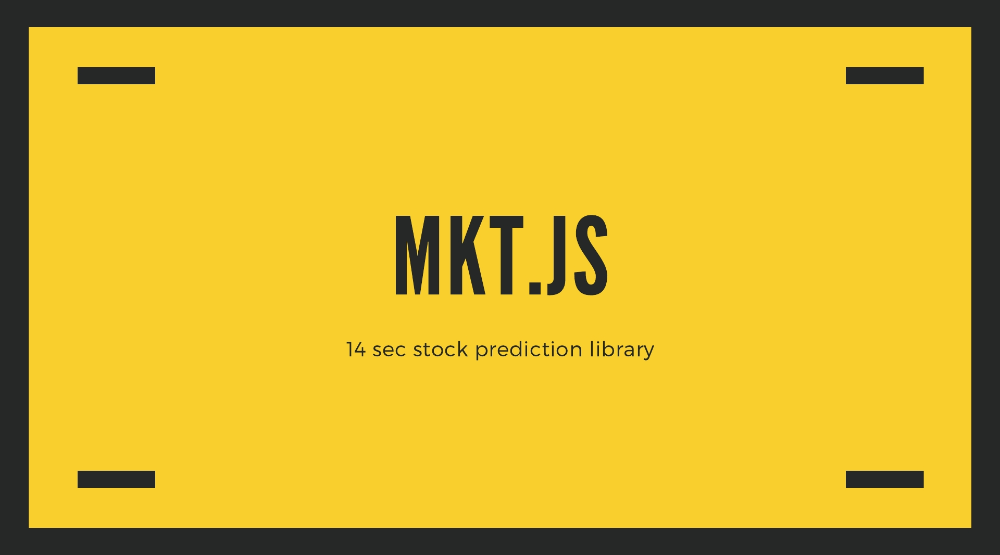

# MKT




MKT.js is an Exchange Price Service , Stocks , Cryptocurrency,Stock prediction and more \
This package contains hundreds of currencies, cryptocurrencies and stocks prices.\
6,096 coin , 283,037 TRADING PAIRS , 31 News Provider It also works with the TensorFlow  Read more here [Read more about crypto-compare service](https://min-api.cryptocompare.com/faq)
for market forecasting / stock prediction using RNN and also works on the visualizing of stocks data using canvas.js

## Dependencies
- Neural Networks (brain.js)
- Tensorflow Framework ( tensorflow.js )
- Main Api ( min-api.cryptocompare.com )


###  Get started :
#### 1 -  Get Full details response (multiple fsym & tsym)

```
const { MKT } = require('@mkt-eg/mkt')

const mkt = new MKT(
  'bbbc22c3a13c74456a6d4bb7ba5745476ebfdc81c867fc240258122b78eb6a6f'
)
const data = mkt
  .exchange({
    fsym: 'BTC',
    tsyms: 'USD',
    type: 'full'
  })
  .then(response => {
    console.log(JSON.stringify(response.data))
  })
  .catch(error => {
    console.log(error)
  })
```
JSON OUTPUT

```

{
   "RAW":{
      "BTC":{
         "USD":{
            "TYPE":"5",
            "MARKET":"CCCAGG",
            "FROMSYMBOL":"BTC",
            "TOSYMBOL":"USD",
            "FLAGS":"2",
            "PRICE":9885.11,
            "LASTUPDATE":1563398729,
            "LASTVOLUME":0.1,
            "LASTVOLUMETO":986.6100000000001,
            "LASTTRADEID":"379345663",
            "VOLUMEDAY":93692.97987050914,
            "VOLUMEDAYTO":893517565.3549776,
            "VOLUME24HOUR":104598.9946433591,
            "VOLUME24HOURTO":997000834.8997525,
            "OPENDAY":9423.44,
            "HIGHDAY":9982.24,
            "LOWDAY":9086.51,
            "OPEN24HOUR":9649.99,
            "HIGH24HOUR":9988.35,
            "LOW24HOUR":9076.48,
            "LASTMARKET":"Bitfinex",
            "VOLUMEHOUR":2210.51459713301,
            "VOLUMEHOURTO":21755061.31969251,
            "OPENHOUR":9692.2,
            "HIGHHOUR":9943.53,
            "LOWHOUR":9663.39,
            "TOPTIERVOLUME24HOUR":101424.52271706509,
            "TOPTIERVOLUME24HOURTO":966363837.9391046,
            "CHANGE24HOUR":235.1200000000008,
            "CHANGEPCT24HOUR":2.436479208786753,
            "CHANGEDAY":461.6700000000001,
            "CHANGEPCTDAY":4.899166334162472,
            "SUPPLY":17823212,
            "MKTCAP":176184411173.32,
            "TOTALVOLUME24H":720083.9899007804,
            "TOTALVOLUME24HTO":7081137716.36884,
            "TOTALTOPTIERVOLUME24H":425384.18596477184,
            "TOTALTOPTIERVOLUME24HTO":4168740744.7056427,
            "IMAGEURL":"/media/19633/btc.png"
         }
      }
   },
   "DISPLAY":{
      "BTC":{
         "USD":{
            "FROMSYMBOL":"Ƀ",
            "TOSYMBOL":"$",
            "MARKET":"CryptoCompare Index",
            "PRICE":"$ 9,885.11",
            "LASTUPDATE":"Just now",
            "LASTVOLUME":"Ƀ 0.1000",
            "LASTVOLUMETO":"$ 986.61",
            "LASTTRADEID":"379345663",
            "VOLUMEDAY":"Ƀ 93,693.0",
            "VOLUMEDAYTO":"$ 893,517,565.4",
            "VOLUME24HOUR":"Ƀ 104,599.0",
            "VOLUME24HOURTO":"$ 997,000,834.9",
            "OPENDAY":"$ 9,423.44",
            "HIGHDAY":"$ 9,982.24",
            "LOWDAY":"$ 9,086.51",
            "OPEN24HOUR":"$ 9,649.99",
            "HIGH24HOUR":"$ 9,988.35",
            "LOW24HOUR":"$ 9,076.48",
            "LASTMARKET":"Bitfinex",
            "VOLUMEHOUR":"Ƀ 2,210.51",
            "VOLUMEHOURTO":"$ 21,755,061.3",
            "OPENHOUR":"$ 9,692.20",
            "HIGHHOUR":"$ 9,943.53",
            "LOWHOUR":"$ 9,663.39",
            "TOPTIERVOLUME24HOUR":"Ƀ 101,424.5",
            "TOPTIERVOLUME24HOURTO":"$ 966,363,837.9",
            "CHANGE24HOUR":"$ 235.12",
            "CHANGEPCT24HOUR":"2.44",
            "CHANGEDAY":"$ 461.67",
            "CHANGEPCTDAY":"4.90",
            "SUPPLY":"Ƀ 17,823,212.0",
            "MKTCAP":"$ 176.18 B",
            "TOTALVOLUME24H":"Ƀ 720.08 K",
            "TOTALVOLUME24HTO":"$ 7.08 B",
            "TOTALTOPTIERVOLUME24H":"Ƀ 425.38 K",
            "TOTALTOPTIERVOLUME24HTO":"$ 4.17 B",
            "IMAGEURL":"/media/19633/btc.png"
         }
      }
   }
}


```

#### 2 -  Get Single price response (Single Ftsym only)

```
const { MKT } = require('@mkt-eg/mkt')

const mkt = new MKT(
  'bbbc22c3a13c74456a6d4bb7ba5745476ebfdc81c867fc240258122b78eb6a6f'
)
const data = mkt
  .exchange({
    fsym: 'BTC', // Single Fysm only
    tsyms: 'USD,EGP', // Multiaple Tsyms is allowed
    type: 'single'
  })
  .then(response => {
    console.log(JSON.stringify(response.data))
  })
  .catch(error => {
    console.log(error)
  })

```
JSON OUTPUT

```
{
   "USD":9888.01,
   "EGP":182256.26
}
````


#### 3 -  Get Multiaple price response

```
const { MKT } = require('@mkt-eg/mkt')

const mkt = new MKT(
  'bbbc22c3a13c74456a6d4bb7ba5745476ebfdc81c867fc240258122b78eb6a6f'
)
const data = mkt
  .exchange({
    fsym: 'BTC,ETH', // Single Fysm only
    tsyms: 'USD,EGP', // Multiaple Tsyms is allowed
    type: 'multi'
  })
  .then(response => {
    console.log(JSON.stringify(response.data))
  })
  .catch(error => {
    console.log(error)
  })

```
 JSON OUTPUT

```
{
   "BTC":{
      "USD":9906.65,
      "EGP":182256.26
   },
   "ETH":{
      "USD":215.27,
      "EGP":3964.07
   }
}

```


#### 4 - Historical Day/hour/minute OHLCV
Get open, high, low, close, volumefrom and volumeto from the daily historical data.The values are based on 00:00 GMT time. It uses BTC conversion if data is not available because the coin is not trading in the specified currency. If you want to get all the available historical data, you can use limit=2000 and keep going back in time using the toTs param. You can then keep requesting batches using: &limit=2000&toTs={the earliest timestamp received}.

 * apiType parms : 'day' or 'hour' or 'minute'
 * you can left some parameter empty its okay
 * to know more about Request Params please read [Here](https://min-api.cryptocompare.com/documentation?key=Historical&cat=dataHistoday)

```
const { MKT } = require('@mkt-eg/mkt')
const MKT = new MKT('bbbc22c3a13c74456a6d4bb7ba5745476ebfdc81c867fc240258122b78eb6a6f')
MKT.historical({
  sympolPrice: 'true',
  e: 'CCCAGG',
  fsym: 'BTC',
  tsyms: 'USD',
  type: 'single',
  aggregate: '1',
  aggregatePredictableTimePeriods: true,
  limit: 100,
  allData: 'false',
  extraParams: 'NotAvailable',
  sign: 'false',
  apiType: 'hour'
}).then((results)=>{
 console.log(results.data)
})
```
 JSON OUTPUT

```

{
   "Response":"Success",
   "Type":100,
   "Aggregated":false,
   "Data":[

      {
         "time":1563544800,
         "close":10341.37,
         "high":10425.08,
         "low":10284.69,
         "open":10319.53,
         "volumefrom":1326,
         "volumeto":13724171.79
      },
      {..},
      {..},
      {..}
   ],
   "TimeTo":1563544800,
   "TimeFrom":1563526800,
   "FirstValueInArray":true,
   "ConversionType":{
      "type":"direct",
      "conversionSymbol":""
   },
   "RateLimit":{

   },
   "HasWarning":false
}

```

#### 4 - Stock Prediction

Before you start in this section, I recommend that you consult some libraries that can help you to build Neural Network through JavaScript, because we will use them in this section like : [Brain.js]([https://github.com/BrainJS/brain.js](https://github.com/BrainJS/brain.js)

````

const array = require('lodash/array');
const { MKT } = require('@mkt-eg/mkt')

const MKT = new MKT('bbbc22c3a13c74456a6d4bb7ba5745476ebfdc81c867fc240258122b78eb6a6f')
MKT.historical({
  sympolPrice: 'true',
  e: 'CCCAGG',
  fsym: 'BTC',
  tsyms: 'USD',
  type: 'single',
  aggregate: '1',
  aggregatePredictableTimePeriods: true,
  limit: 30,
  allData: 'false',
  extraParams: 'NotAvailable',
  sign: 'false',
  apiType: 'day'
}).then((results)=>{
const data = JSON.stringify(results.data)
const options = {
rawData:data,
chunkSize:5,// split data into 5 series array
forcastList:array.chunk(rawData,5)[3], // Get The last series from data.
steps:30, // predicit the next 30 days
NNOptions: {
      inputSize: 4,
      hiddenLayers: [4,4],
      outputSize: 4,
      learningRate: 0.01,
      decayRate: 0.999,
},    
trainOptions:{
      iterations: 20000,    // the maximum times to iterate the training data --> number greater than 0
      errorThresh: 0.005,   // the acceptable error percentage from training data --> number between 0 and 1
      log: true,           // true to use console.log, when a function is supplied it is used --> Either true or a function
      logPeriod: 10,        // iterations between logging out --> number greater than 0
      learningRate: 0.3,    // scales with delta to effect training rate --> number between 0 and 1
      momentum: 0.1,        // scales with next layer's change value --> number between 0 and 1
      callback: null,       // a periodic call back that can be triggered while training --> null or function
      callbackPeriod: 10,   // the number of iterations through the training data between callback calls --> number greater than 0
      timeout: Infinity     // the max number of milliseconds to train for --> number greater than 0
}
}

 console.log(MKT.predict(options))

})


````

Output
```
[ {
	"close":11740.34,
	"high":11778.22,
	"low":10992.37,
	"open":11035.74,
   },
   {..},
   {..},
   {..}
   ...
]
```


## Some of the ideas I put forward and you can get started:
- Add processing of natural languages to increase confidence in prices that have been predicted
- Add simulation of the investment process and the development of some strategies of trades.
- Monitor the markets and manufacture a global dashboard.
- add simples and examples using MKT.JS


## contributions
- For the first contributor you can delete the file and be the first shareholder (I left it to you)
- For the rest, if you think of an idea, you should make pull request and apply it immediately.


Author : Loaii abdalslam
